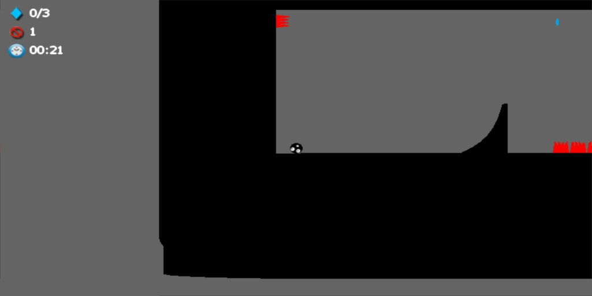
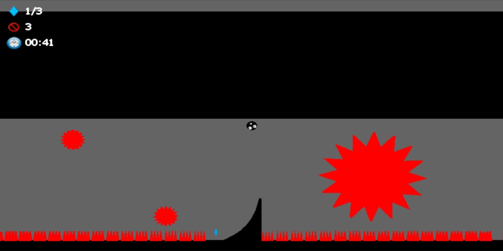
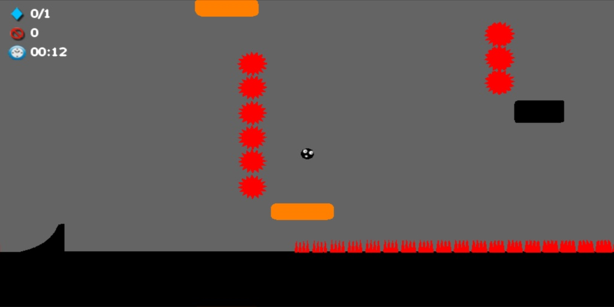
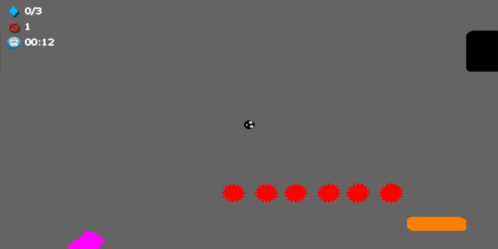
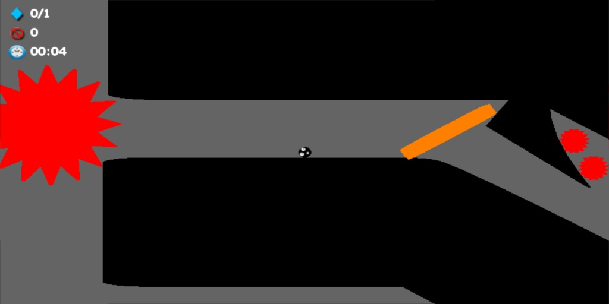

# crazypill
Binaries for a minimalistic game created using Havok Anarchy engine. https://github.com/projectanarchy

Binary is Bin/bin100dx9x86/CrazyPill.exe

Just move your pod until reach the goal.   
You can save progression on three slots, number of diamonds, time and kills will be scored.

# Controls
Only three keys are used:
<pre>
[LEFT/RIGHT] Move + Cannon rotation 
[LEFT CONTROL] Stick to surfaces + Shoot cannon
[UP/DOWN] Camera zoom
[ESC] closes the game any time
[BACKSPACE] to back to menu during playing
</pre>
  
# Notes

  Levels 7 and 9 are a bit hard, some adjustment is needed.
  
